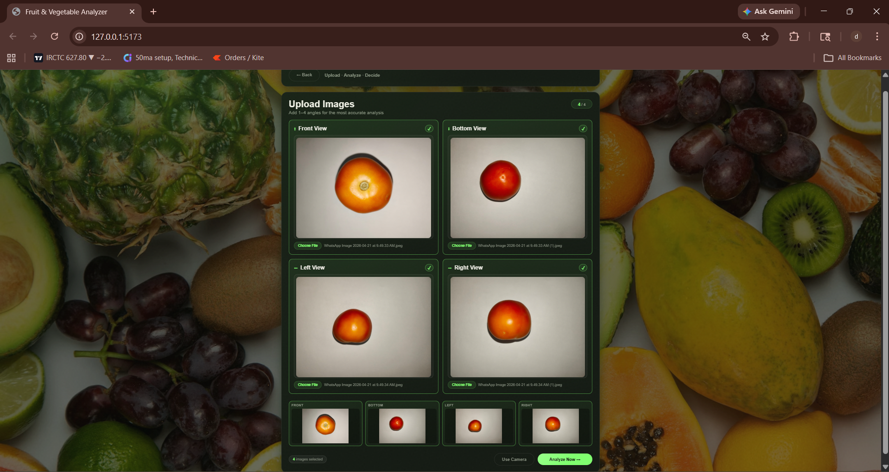
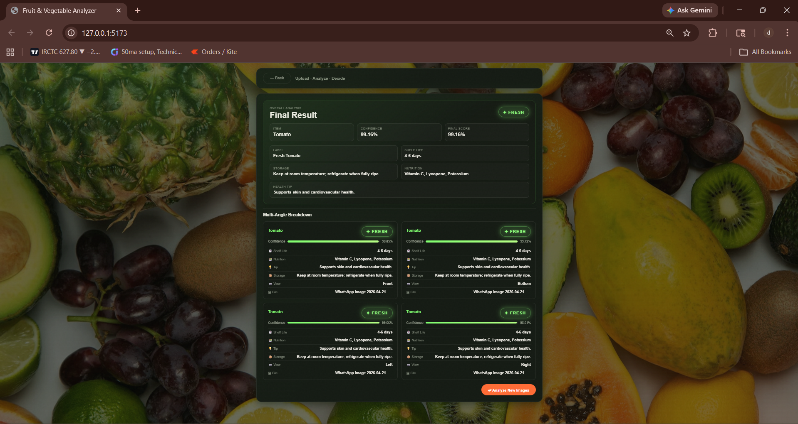
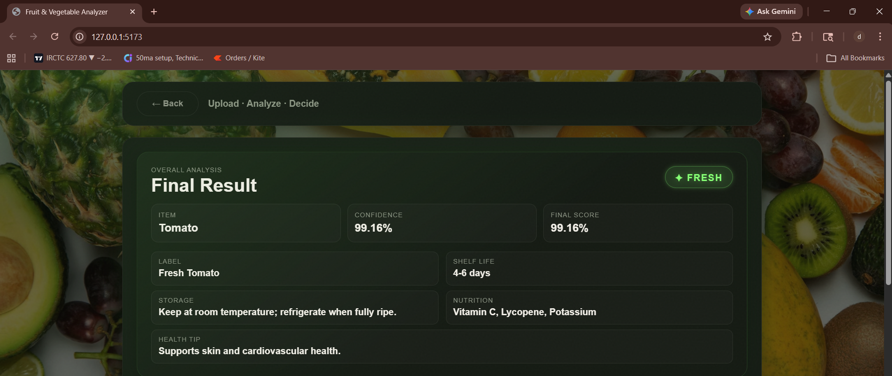
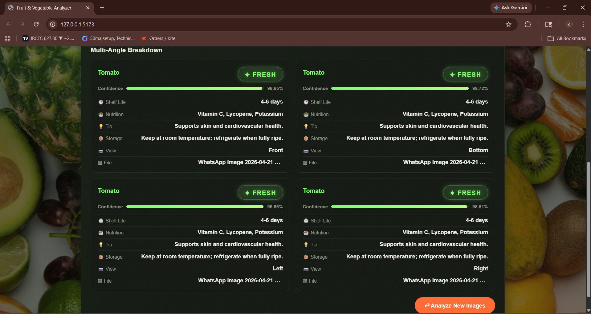

# 🥦 Fruits & Vegetables Analyzer

An AI-powered web application that analyzes fruits and vegetables to determine **freshness, quality, and nutritional insights** using deep learning.

---

## 🚀 Features

* 📸 Upload fruit/vegetable images
* 🧠 Detect **Fresh / Rotten**
* 📊 Confidence score prediction
* ⏳ Shelf-life estimation
* 🥗 Nutritional insights
* ⚡ Fast and responsive UI

---

## 🧠 Tech Stack

### 🔹 Backend

* Python
* FastAPI / Flask
* PyTorch (Deep Learning)

### 🔹 Frontend

* React (Vite)
* HTML, CSS, JavaScript

---

## 📂 Project Structure

```
fruit-analyzer/
├── backend/
├── frontend/
├── screenshots/
├── README.md
```

---

## ⚙️ How to Run Locally

### 🔹 Backend

```bash
cd backend
pip install -r requirements.txt
python main.py
```

---

### 🔹 Frontend

```bash
cd frontend
npm install
npm run dev
```

---

## 📸 Screenshots

### 🔹 Upload Page



### 🔹 Result Page



### 🔹 Prediction Output



### 🔹 Prediction Output



---

## 🧪 Model Details

* Architecture: MobileNetV2
* Dataset: Custom dataset (~20,000 images)
* Framework: PyTorch

---

## 🔗 Future Improvements

* 🔴 Live camera detection
* 🌐 Deploy full-stack app online
* 📈 Improve model accuracy
* 📱 Mobile responsiveness

---

## 🤝 Contributing

Feel free to fork this repo and improve the project.

---

## 📜 License

This project is open-source and available under the MIT License.

---

## 👨‍💻 Author

**Dhamodaran M**

**Srinivasan AL**

---

⭐ If you like this project, give it a star!
